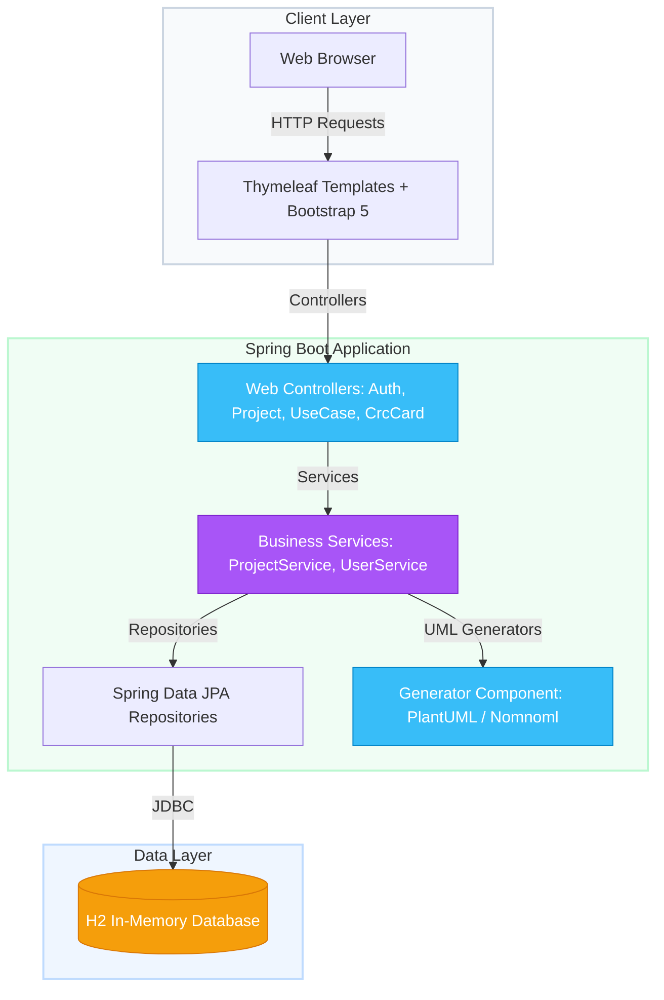

# Software Engineering Requirements Web App

<p align="center">
  
</p>

<p align="center">
  
  
  
  
  
  
</p>

---

## 👥 Author & Owner
* **Panagiotis Christodoulou** (AM: 5501) — *Owner & Developer*

---

### 🌟 Overview
The **Requirements Specification & Analysis Application** is a collaborative workspace designed to streamline the software engineering requirements phase. It enables teams to write user stories, define **Use Cases**, map **Class-Responsibility-Collaborator (CRC) Cards**, and automatically compile requirements into ready-to-render **UML diagrams** (using PlantUML and Nomnoml).

---

## 🚀 Quick Start & Environment

### Option A: Running from Eclipse IDE (Recommended)
This project was developed and tested using **Eclipse IDE**. To run:
1. Ensure you have the **Spring Tools** suite installed (*Help → Eclipse Marketplace*).
2. Go to **File → Import → Maven → Existing Maven Projects**.
3. Click **Browse**, select this project's folder, and click **Finish**.
4. In the Package Explorer, expand the packages: `src/main/java` $\rightarrow$ `com.reqapp`.
5. Right-click [RequirementsAppApplication.java](src/main/java/com/reqapp/RequirementsAppApplication.java) and select **Run As → Spring Boot App**.

### Option B: Running from Command Line (Maven CLI)
* **Prerequisites:** Java 17+ and Maven installed.
1. **Clone the repository:**
   ```bash
   git clone <repository-url>
   cd software-engineering-requirements-web-app
   ```
2. **Build the application:**
   ```bash
   mvn clean install
   ```
3. **Run the application:**
   ```bash
   mvn spring-boot:run
   ```

### Access Ports & Console
* **Web Application URL:** Open [http://localhost:8080](http://localhost:8080)
* **H2 In-Memory Database Console:** Open [http://localhost:8080/h2-console](http://localhost:8080/h2-console)
  * *JDBC URL:* `jdbc:h2:mem:testdb`
  * *User:* `Project`
  * *Password:* `[leave empty]`

---

## 🛠 Features Matrix

| Feature | Description | Entities |
| :--- | :--- | :--- |
| **Project Workspaces** | Create project directories and collaborate with team members. | `Project`, `User` |
| **Use Case Builder** | Document functional requirements (Preconditions, Flows, Postconditions) and link to Actors. | `UseCase`, `Actor`, `UseCaseComment` |
| **CRC Card Designer** | Define object-oriented designs by specifying class names, responsibilities, and collaborators. | `CrcCard`, `CrcCardComment` |
| **UML Script Generator** | Instantly compile projects into PlantUML and Nomnoml diagrams. | `GeneratorFactory` |
| **Interactive Discussion** | Threaded commentary on Use Cases and CRC Cards to support agile reviews. | `UseCaseComment`, `CrcCardComment` |

---

## 🧱 Architecture Overview



---

## 📂 Project Structure

```
software-engineering-requirements-web-app/
├── src/
│   ├── main/
│   │   ├── java/com/reqapp/
│   │   │   ├── config/             # Spring Security configuration
│   │   │   ├── controller/         # Web MVC controllers (Auth, Projects, CRC, UseCases)
│   │   │   ├── domain/             # JPA entity models (Project, UseCase, CrcCard, User, Actor)
│   │   │   ├── generator/          # PlantUML & Nomnoml script generators
│   │   │   ├── repository/         # Spring Data JPA repositories
│   │   │   └── service/            # Business logic interfaces & implementations
│   │   └── resources/
│   │       ├── templates/          # Thymeleaf views and page layouts
│   │       └── application.properties
│   └── test/                       # Unit, repository, integration and acceptance tests
├── banner.svg                      # Animated README banner
└── pom.xml                         # Maven dependencies and configuration
```

---

## 🧪 Testing Suite

Automated testing was implemented using **JUnit 5**, **Mockito**, and Spring Boot test facilities to validate core system behaviors.

### Unit Tests
* **`DiagramGeneratorTest`**: Verifies that `GeneratorFactory` creates correct PlantUML/Nomnoml generator implementations, and validates generated script contents for correctness.
* **`ProjectServiceTest`**: Validates project operations (save, delete) and checks that sharing permissions/access are correctly restricted.
* **`ProjectServiceCommentTest`**: Tests saving and retrieving discussion comments for Use Cases and CRC Cards.

### Repository Tests
* **`ProjectRepositoryTest`**: Validates custom Spring Data JPA queries in the database layer, checking that project owners and teammates can fetch projects correctly, but unrelated users are blocked.

### Integration Tests
* **`SimpleSecurityAndAccessIntegrationTest`**: Tests authentication rules and redirects unauthorized traffic back to the login view.

To execute the test suite:
```bash
mvn test
```
*(Alternatively, in Eclipse, right-click the project folder and click **Run As → JUnit Test**).*

---

## 💡 Detailed Guides & Walkthroughs (Click to Expand)

<details>
<summary><b>📖 Walkthrough: Creating a Project & Collaborating</b></summary>
<br>

1. **Register & Log In**: Go to the `/register` endpoint to create a new user account, then sign in via `/login`.
2. **Create a Project**: Click on **Create Project** on your dashboard. Provide a name and description.
3. **Add Teammates**: Open the project details page and enter teammate usernames to add them to the workspace. All teammates will be granted permissions to view and edit the project's requirements.
</details>

<details>
<summary><b>🤖 Walkthrough: Writing Use Cases & CRC Cards</b></summary>
<br>

* **Writing Use Cases**: 
  1. Add an **Actor** (e.g., *Customer*, *Admin*) on your project page.
  2. Click **Create Use Case**, specify the title, preconditions, main flow of events, and postconditions.
  3. Check the boxes corresponding to the actors participating in this Use Case.
  
* **Designing CRC Cards**:
  1. Click **Create CRC Card**.
  2. Input the Class Name (e.g., `PaymentService`), its primary Responsibilities, and any Collaborating Classes.
  3. Associate the CRC Card with Use Cases to trace your domain classes directly to system requirements.
</details>

<details>
<summary><b>🎨 Walkthrough: Generating & Visualizing UML Diagrams</b></summary>
<br>

This application automatically converts your structural data into UML code!

1. Go to your project dashboard and click on **Generate Diagrams**.
2. **Select Diagram Type**:
   * **Use Case Diagram**: Automatically creates a map of actors and their use cases.
   * **Class Diagram**: Translates your CRC cards into structural classes with attributes and collaborations.
3. **Select Tool Format**:
   * **PlantUML**: Generates code compatible with the [PlantUML Live Editor](https://www.plantuml.com/plantuml/uml/).
   * **Nomnoml**: Generates code compatible with the [Nomnoml Live Canvas](https://www.nomnoml.com/).
4. Click **Generate**, copy the produced script, and paste it into the respective editor for a beautiful diagram layout.
</details>

---

<p align="center">
  <sub>Developed as part of the Software Engineering curriculum • Built with 💚 using Spring Boot</sub>
</p>
